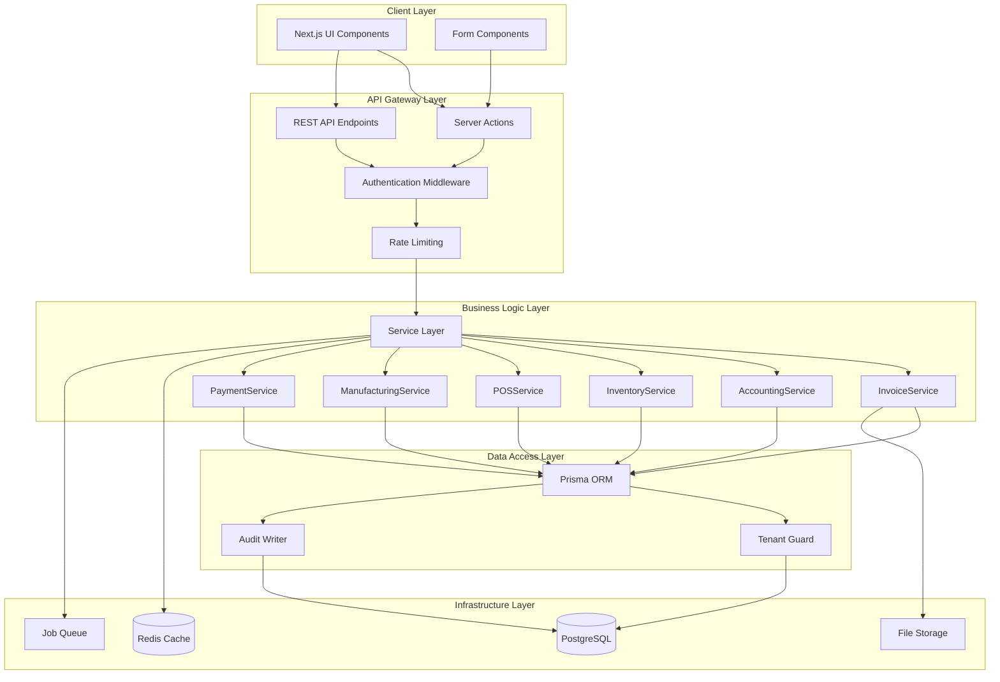
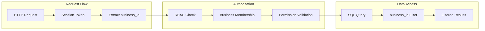
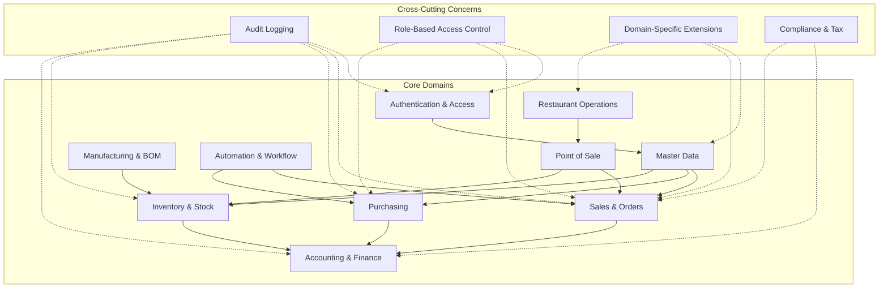

# Design Document: ERP System Architecture Audit and Improvements

## Overview

### Purpose

This design document provides a comprehensive technical architecture for auditing and improving a multi-tenant ERP+Inventory+POS system managing 76 Prisma data models across 15+ functional domains. The design addresses critical gaps in schema integrity, API coverage, frontend-backend integration, business logic completeness, security, performance, and data consistency.

### System Context

**Current State:**
- **76 Prisma models** organized across authentication, inventory, manufacturing, sales, purchasing, finance, POS, restaurant, loyalty, and workflow domains
- **Multi-tenant architecture** with business_id enforcement across all entities
- **Multi-domain support** via unique domain field and extensible domain_data JSON fields
- **Tier-based feature access** (Free, Starter, Business, Premium, Enterprise)
- **Server Actions pattern** with emerging service layer architecture
- **PostgreSQL database** with Prisma ORM
- **Next.js App Router** with Server Components

**Scope of Improvements:**
- Schema integrity validation and relationship auditing
- Database index optimization for query performance
- Multi-tenancy enforcement verification
- Comprehensive REST API layer for external integrations
- Frontend-backend integration validation
- Complete business logic implementation for inventory, financial, POS, and manufacturing workflows
- Security hardening (RBAC, audit trails, data encryption)
- Performance optimization (caching, query optimization, background jobs)
- Compliance and regulatory requirements

### Design Principles

1. **Tenant Isolation First**: Every query, operation, and API endpoint must enforce business_id filtering
2. **Audit Everything**: All state changes must be logged to audit_logs with full context
3. **Fail Safely**: Validation failures should prevent data corruption, not crash the system
4. **Performance by Default**: Indexes, caching, and pagination must be built-in, not retrofitted
5. **Extensibility**: Domain-specific logic should extend core patterns without modifying them
6. **Type Safety**: Leverage TypeScript and Zod schemas for compile-time and runtime validation
7. **Service Layer Consistency**: All business logic should flow through service classes, not direct SQL
8. **Idempotency**: Critical operations (payments, stock movements) must be safely retryable

## Architecture

### High-Level System Architecture



### Multi-Tenancy Architecture



**Enforcement Layers:**

1. **Schema Level**: All models have business_id foreign key with cascade rules
2. **Query Level**: All Prisma queries include business_id in WHERE clause
3. **Application Level**: withGuard() validates user access to business_id
4. **API Level**: All endpoints extract and validate business_id from session
5. **Database Level** (Proposed): Row-Level Security (RLS) policies as defense-in-depth

### Domain Architecture



## Components and Interfaces

### Service Layer Architecture

The service layer provides a consistent abstraction over data access and business logic. All services follow these patterns:

**Base Service Interface:**

```typescript
interface BaseService<T> {
  // CRUD Operations
  create(data: CreateDTO, context: ServiceContext): Promise<T>;
  findById(id: string, context: ServiceContext): Promise<T | null>;
  findMany(filters: FilterDTO, context: ServiceContext): Promise<T[]>;
  update(id: string, data: UpdateDTO, context: ServiceContext): Promise<T>;
  softDelete(id: string, context: ServiceContext): Promise<void>;
  
  // Validation
  validate(data: unknown): ValidationResult;
  
  // Audit
  auditOperation(operation: string, entityId: string, context: ServiceContext): Promise<void>;
}

interface ServiceContext {
  businessId: string;
  userId: string;
  session: Session;
  transaction?: PrismaTransaction;
}
```

### Core Services

#### 1. InvoiceService

**Responsibilities:**
- Invoice lifecycle management (create, void, fulfill)
- Invoice item management
- Stock reservation and fulfillment
- GL entry creation for revenue, COGS, inventory
- Payment status tracking
- Credit note generation

**Key Methods:**

```typescript
class InvoiceService {
  async createInvoice(data: CreateInvoiceDTO, context: ServiceContext): Promise<Invoice> {
    // 1. Validate invoice data
    // 2. Generate invoice number via DocumentSequenceService
    // 3. Create invoice header
    // 4. Create invoice items
    // 5. Reserve inventory via InventoryService
    // 6. Create GL entries via AccountingService
    // 7. Audit operation
    // 8. Return created invoice
  }
  
  async fulfillInvoice(invoiceId: string, context: ServiceContext): Promise<Invoice> {
    // 1. Validate invoice status (must be 'confirmed')
    // 2. Convert inventory reservations to stock movements
    // 3. Update invoice status to 'fulfilled'
    // 4. Create delivery challan (optional)
    // 5. Audit operation
  }
  
  async voidInvoice(invoiceId: string, reason: string, context: ServiceContext): Promise<Invoice> {
    // 1. Validate invoice can be voided
    // 2. Release inventory reservations
    // 3. Reverse GL entries
    // 4. Update invoice status to 'void'
    // 5. Audit operation with reason
  }
  
  async allocatePayment(invoiceId: string, paymentId: string, amount: Decimal, context: ServiceContext): Promise<PaymentAllocation> {
    // 1. Validate payment amount <= invoice outstanding
    // 2. Create payment_allocation record
    // 3. Update invoice payment_status
    // 4. Update customer outstanding_balance
    // 5. Create GL entries for payment
    // 6. Audit operation
  }
}
```

#### 2. InventoryService

**Responsibilities:**
- Stock level management across warehouses
- Stock movement tracking
- Inventory ledger maintenance
- Reservation management
- Batch and serial number tracking
- Multi-warehouse transfers
- Stock reconciliation

**Key Methods:**

```typescript
class InventoryService {
  async reserveStock(productId: string, quantity: Decimal, referenceType: string, referenceId: string, context: ServiceContext): Promise<InventoryReservation> {
    // 1. Check available stock (stock - reserved)
    // 2. Create inventory_reservation record
    // 3. Update product available quantity (denormalized)
    // 4. Audit operation
  }
  
  async fulfillReservation(reservationId: string, warehouseId: string, context: ServiceContext): Promise<StockMovement> {
    // 1. Validate reservation exists and is active
    // 2. Create stock_movement (negative quantity)
    // 3. Update product_stock_locations
    // 4. Update inventory_ledger running balance
    // 5. Mark reservation as fulfilled
    // 6. Audit operation
  }
  
  async transferStock(productId: string, quantity: Decimal, sourceWarehouseId: string, destWarehouseId: string, context: ServiceContext): Promise<StockTransfer> {
    // 1. Validate source warehouse has sufficient stock
    // 2. Create stock_transfer record (status: 'pending')
    // 3. Create stock_movement for source (negative, status: 'in_transit')
    // 4. Update stock_transfer status to 'in_transit'
    // 5. Audit operation
  }
  
  async receiveTransfer(transferId: string, context: ServiceContext): Promise<StockTransfer> {
    // 1. Validate transfer is 'in_transit'
    // 2. Create stock_movement for destination (positive)
    // 3. Update product_stock_locations for both warehouses
    // 4. Update inventory_ledger for both warehouses
    // 5. Update stock_transfer status to 'received'
    // 6. Audit operation
  }
  
  async adjustStock(productId: string, warehouseId: string, quantity: Decimal, reason: string, context: ServiceContext): Promise<StockMovement> {
    // 1. Validate adjustment reason
    // 2. Create stock_movement (type: 'adjustment')
    // 3. Update product_stock_locations
    // 4. Update inventory_ledger
    // 5. Update product.stock (denormalized)
    // 6. Audit operation with reason
  }
  
  async reconcileStock(productId: string, warehouseId: string, physicalCount: Decimal, context: ServiceContext): Promise<ReconciliationResult> {
    // 1. Get current system stock from inventory_ledger
    // 2. Calculate variance (physical - system)
    // 3. If variance != 0, create adjustment stock_movement
    // 4. Update all stock tracking fields
    // 5. Generate reconciliation report
    // 6. Audit operation
  }
}
```

#### 3. AccountingService

**Responsibilities:**
- GL account management
- GL entry creation (double-entry bookkeeping)
- Journal entry management
- Fiscal period management
- Financial report generation
- Account balance calculation

**Key Methods:**

```typescript
class AccountingService {
  async createGLEntry(data: CreateGLEntryDTO, context: ServiceContext): Promise<GLEntry[]> {
    // 1. Validate debit/credit balance
    // 2. Validate accounts exist and are active
    // 3. Create GL entry records (debit and credit sides)
    // 4. Update account balances (denormalized)
    // 5. Audit operation
  }
  
  async createJournalEntry(data: CreateJournalDTO, context: ServiceContext): Promise<JournalEntry> {
    // 1. Validate journal data
    // 2. Validate debits = credits
    // 3. Create journal_entry header
    // 4. Create multiple gl_entries
    // 5. Update account balances
    // 6. Audit operation
  }
  
  async getAccountBalance(accountId: string, asOfDate: Date, context: ServiceContext): Promise<Decimal> {
    // 1. Sum all gl_entries for account up to date
    // 2. Apply account type rules (debit/credit normal balance)
    // 3. Return calculated balance
  }
  
  async closeFiscalPeriod(periodId: string, context: ServiceContext): Promise<FiscalPeriod> {
    // 1. Validate all transactions are posted
    // 2. Calculate period-end balances
    // 3. Create closing entries
    // 4. Mark period as closed
    // 5. Prevent further postings to period
    // 6. Audit operation
  }
}
```

#### 4. POSService

**Responsibilities:**
- POS terminal management
- POS session (shift) management
- Transaction processing
- Payment method handling
- Receipt generation
- POS-to-invoice conversion
- Refund processing

**Key Methods:**

```typescript
class POSService {
  async openSession(terminalId: string, openingCash: Decimal, context: ServiceContext): Promise<POSSession> {
    // 1. Validate terminal exists and is active
    // 2. Validate no open session for terminal
    // 3. Create pos_session record
    // 4. Audit operation
  }
  
  async createTransaction(data: CreatePOSTransactionDTO, context: ServiceContext): Promise<POSTransaction> {
    // 1. Validate session is open
    // 2. Create pos_transaction header
    // 3. Create pos_transaction_items
    // 4. Create pos_payments
    // 5. Update stock via InventoryService
    // 6. Optionally create invoice via InvoiceService
    // 7. Apply loyalty points if applicable
    // 8. Audit operation
  }
  
  async convertToInvoice(transactionId: string, context: ServiceContext): Promise<Invoice> {
    // 1. Validate transaction exists and is completed
    // 2. Validate no existing invoice link
    // 3. Create invoice via InvoiceService
    // 4. Link invoice_id to pos_transaction
    // 5. Ensure stock movements match
    // 6. Ensure GL entries match
    // 7. Audit operation
  }
  
  async closeSession(sessionId: string, closingCash: Decimal, context: ServiceContext): Promise<POSSession> {
    // 1. Validate session is open
    // 2. Calculate expected cash from transactions
    // 3. Calculate variance (closing - expected)
    // 4. Update session with closing data
    // 5. Mark session as closed
    // 6. Generate session report
    // 7. Audit operation
  }
  
  async processRefund(transactionId: string, items: RefundItemDTO[], context: ServiceContext): Promise<POSRefund> {
    // 1. Validate original transaction
    // 2. Validate refund items match original
    // 3. Create pos_refund record
    // 4. Create pos_refund_items
    // 5. Reverse stock movements via InventoryService
    // 6. Create credit note if invoice exists
    // 7. Reverse loyalty points if applicable
    // 8. Audit operation
  }
}
```

#### 5. ManufacturingService

**Responsibilities:**
- BOM management
- Production order lifecycle
- Raw material reservation and consumption
- Finished goods production
- Multi-warehouse routing
- Production cost calculation

**Key Methods:**

```typescript
class ManufacturingService {
  async createProductionOrder(data: CreateProductionOrderDTO, context: ServiceContext): Promise<ProductionOrder> {
    // 1. Validate BOM exists for product
    // 2. Validate warehouses exist
    // 3. Create production_order record
    // 4. Calculate required raw materials (BOM explosion)
    // 5. Audit operation
  }
  
  async startProduction(orderId: string, context: ServiceContext): Promise<ProductionOrder> {
    // 1. Validate order status is 'planned'
    // 2. Validate raw material availability in input warehouse
    // 3. Reserve raw materials via InventoryService
    // 4. Update order status to 'in_progress'
    // 5. Audit operation
  }
  
  async completeProduction(orderId: string, actualQuantity: Decimal, context: ServiceContext): Promise<ProductionOrder> {
    // 1. Validate order status is 'in_progress'
    // 2. Consume raw materials (create negative stock_movements)
    // 3. Produce finished goods (create positive stock_movements in output warehouse)
    // 4. Calculate production cost (sum of raw material costs)
    // 5. Create GL entries (debit inventory, credit raw materials)
    // 6. Update order status to 'completed'
    // 7. Release any unused reservations
    // 8. Audit operation
  }
  
  async cancelProduction(orderId: string, reason: string, context: ServiceContext): Promise<ProductionOrder> {
    // 1. Validate order can be cancelled
    // 2. Release all raw material reservations
    // 3. Update order status to 'cancelled'
    // 4. Audit operation with reason
  }
}
```

#### 6. PaymentService

**Responsibilities:**
- Payment recording
- Payment allocation to invoices/purchases
- Payment reconciliation
- Outstanding balance calculation
- Payment method validation

**Key Methods:**

```typescript
class PaymentService {
  async recordPayment(data: CreatePaymentDTO, context: ServiceContext): Promise<Payment> {
    // 1. Validate payment data
    // 2. Create payment record
    // 3. Create payment_allocations
    // 4. Update invoice/purchase payment_status
    // 5. Update customer/vendor outstanding_balance
    // 6. Create GL entries via AccountingService
    // 7. Audit operation
  }
  
  async allocatePayment(paymentId: string, allocations: AllocationDTO[], context: ServiceContext): Promise<PaymentAllocation[]> {
    // 1. Validate payment exists
    // 2. Validate total allocations <= payment amount
    // 3. Validate invoices/purchases exist and belong to same customer/vendor
    // 4. Create payment_allocation records
    // 5. Update invoice/purchase payment_status
    // 6. Update outstanding balances
    // 7. Audit operation
  }
  
  async voidPayment(paymentId: string, reason: string, context: ServiceContext): Promise<Payment> {
    // 1. Validate payment can be voided
    // 2. Reverse all payment_allocations
    // 3. Update invoice/purchase payment_status
    // 4. Update outstanding balances
    // 5. Reverse GL entries
    // 6. Mark payment as void
    // 7. Audit operation with reason
  }
  
  async reconcilePayments(accountId: string, statementDate: Date, context: ServiceContext): Promise<ReconciliationReport> {
    // 1. Get all payments for account up to date
    // 2. Get bank statement transactions
    // 3. Match payments to statement transactions
    // 4. Identify unmatched items
    // 5. Generate reconciliation report
    // 6. Audit operation
  }
}
```

### Shared Utilities and Helpers

#### TenantGuard

```typescript
class TenantGuard {
  static async validateAccess(businessId: string, userId: string): Promise<boolean> {
    // 1. Check if user is owner of business
    // 2. Check if user is member of business (business_users)
    // 3. Return true if either condition met
  }
  
  static async assertEntityBelongsToBusiness(entityType: string, entityId: string, businessId: string): Promise<void> {
    // 1. Query entity by ID
    // 2. Validate entity.business_id === businessId
    // 3. Throw error if mismatch
  }
  
  static injectBusinessIdFilter(query: PrismaQuery, businessId: string): PrismaQuery {
    // 1. Add business_id to WHERE clause
    // 2. Return modified query
  }
}
```

#### AuditWriter

```typescript
class AuditWriter {
  static async write(data: AuditLogDTO): Promise<void> {
    // 1. Validate audit data
    // 2. Extract IP address and user agent from context
    // 3. Create audit_logs record
    // 4. Fire-and-forget (don't block main operation)
  }
  
  static async writeMany(entries: AuditLogDTO[]): Promise<void> {
    // 1. Batch insert multiple audit entries
    // 2. Used for bulk operations
  }
}
```

#### DocumentSequenceService

```typescript
class DocumentSequenceService {
  static async generateNumber(businessId: string, documentType: string): Promise<string> {
    // 1. Get or create document_sequence for type
    // 2. Increment sequence number (atomic operation)
    // 3. Format number with prefix (e.g., INV-2024-00001)
    // 4. Return formatted number
  }
  
  static async resetSequence(businessId: string, documentType: string, startNumber: number): Promise<void> {
    // 1. Validate no documents exist with higher numbers
    // 2. Update sequence current_number
    // 3. Audit operation
  }
}
```

#### ValidationService

```typescript
class ValidationService {
  static validate<T>(schema: ZodSchema<T>, data: unknown): ValidationResult<T> {
    // 1. Parse data with Zod schema
    // 2. Return success with typed data or failure with errors
  }
  
  static validateDomainData(domain: string, domainData: unknown): ValidationResult {
    // 1. Get domain-specific schema
    // 2. Validate domain_data JSON against schema
    // 3. Return validation result
  }
}
```

## Data Models

### Schema Integrity Improvements

#### 1. Relationship Validation

**Current Issues:**
- Some foreign keys use `onDelete: NoAction` causing potential orphans
- Soft delete cascades not consistently handled
- Circular dependencies (POS_Terminal ↔ Invoice)

**Proposed Changes:**

```prisma
// Standardize cascade rules
model invoice_items {
  invoice_id  String   @db.Uuid
  product_id  String   @db.Uuid
  
  invoice     invoices @relation(fields: [invoice_id], references: [id], onDelete: Cascade)
  product     products @relation(fields: [product_id], references: [id], onDelete: Restrict) // Prevent product deletion if used in invoices
}

// Add check constraints for payment allocations
model payment_allocations {
  invoice_id   String?  @db.Uuid
  purchase_id  String?  @db.Uuid
  
  @@check(raw: "(invoice_id IS NOT NULL AND purchase_id IS NULL) OR (invoice_id IS NULL AND purchase_id IS NOT NULL)")
}

// Ensure soft delete consistency
model products {
  is_deleted  Boolean   @default(false)
  deleted_at  DateTime? @db.Timestamptz(6)
  
  @@check(raw: "(is_deleted = false AND deleted_at IS NULL) OR (is_deleted = true AND deleted_at IS NOT NULL)")
}
```

#### 2. Index Optimization

**Composite Indexes for Common Query Patterns:**

```prisma
model invoices {
  @@index([business_id, date(sort: Desc)])
  @@index([business_id, status, date(sort: Desc)])
  @@index([business_id, customer_id, payment_status])
  @@index([business_id, is_deleted, date(sort: Desc)])
}

model products {
  @@index([business_id, category, is_active])
  @@index([business_id, sku])
  @@index([business_id, barcode])
  @@index([business_id, is_deleted])
}

model stock_movements {
  @@index([business_id, product_id, created_at(sort: Desc)])
  @@index([business_id, warehouse_id, transaction_type])
  @@index([business_id, reference_type, reference_id])
}

model gl_entries {
  @@index([business_id, account_id, transaction_date(sort: Desc)])
  @@index([business_id, reference_type, reference_id])
  @@index([business_id, journal_id])
}

model audit_logs {
  @@index([business_id, entity_type, entity_id])
  @@index([business_id, user_id, created_at(sort: Desc)])
  @@index([business_id, action, created_at(sort: Desc)])
}
```

**GIN Indexes for JSON Fields:**

```prisma
model products {
  domain_data  Json?  @default("{}")
  
  @@index([domain_data], type: Gin)
}

model customers {
  domain_data  Json?  @default("{}")
  
  @@index([domain_data], type: Gin)
}
```

#### 3. Missing Fields and Constraints

**Add Version Fields for Optimistic Locking:**

```prisma
model invoices {
  version     Int      @default(1)
  updated_at  DateTime @updatedAt
}

model products {
  version     Int      @default(1)
  updated_at  DateTime @updatedAt
}

model payments {
  version     Int      @default(1)
  updated_at  DateTime @updatedAt
}
```

**Add Unique Constraints:**

```prisma
model product_serials {
  @@unique([business_id, serial_number])
  @@unique([business_id, imei], where: { imei: { not: null } })
  @@unique([business_id, mac_address], where: { mac_address: { not: null } })
}

model document_sequences {
  @@unique([business_id, document_type])
}
```

### Data Consistency Rules

**Inventory Consistency:**

```sql
-- Product stock must equal sum of warehouse stocks
CREATE OR REPLACE FUNCTION check_product_stock_consistency()
RETURNS TABLE(product_id UUID, product_stock DECIMAL, warehouse_total DECIMAL, variance DECIMAL) AS $$
BEGIN
  RETURN QUERY
  SELECT 
    p.id,
    p.stock,
    COALESCE(SUM(psl.quantity), 0) as warehouse_total,
    p.stock - COALESCE(SUM(psl.quantity), 0) as variance
  FROM products p
  LEFT JOIN product_stock_locations psl ON p.id = psl.product_id
  WHERE p.is_deleted = false
  GROUP BY p.id, p.stock
  HAVING p.stock != COALESCE(SUM(psl.quantity), 0);
END;
$$ LANGUAGE plpgsql;
```

**Financial Consistency:**

```sql
-- GL entries must balance (debits = credits)
CREATE OR REPLACE FUNCTION check_gl_balance()
RETURNS TABLE(journal_id UUID, debit_total DECIMAL, credit_total DECIMAL, variance DECIMAL) AS $$
BEGIN
  RETURN QUERY
  SELECT 
    ge.journal_id,
    SUM(ge.debit) as debit_total,
    SUM(ge.credit) as credit_total,
    SUM(ge.debit) - SUM(ge.credit) as variance
  FROM gl_entries ge
  WHERE ge.journal_id IS NOT NULL
  GROUP BY ge.journal_id
  HAVING SUM(ge.debit) != SUM(ge.credit);
END;
$$ LANGUAGE plpgsql;
```

**Payment Allocation Consistency:**

```sql
-- Payment allocations must not exceed payment amount
CREATE OR REPLACE FUNCTION check_payment_allocation_consistency()
RETURNS TABLE(payment_id UUID, payment_amount DECIMAL, allocated_total DECIMAL, variance DECIMAL) AS $$
BEGIN
  RETURN QUERY
  SELECT 
    p.id,
    p.amount,
    COALESCE(SUM(pa.amount), 0) as allocated_total,
    p.amount - COALESCE(SUM(pa.amount), 0) as variance
  FROM payments p
  LEFT JOIN payment_allocations pa ON p.id = pa.payment_id
  GROUP BY p.id, p.amount
  HAVING p.amount < COALESCE(SUM(pa.amount), 0);
END;
$$ LANGUAGE plpgsql;
```

## Correctness Properties

*A property is a characteristic or behavior that should hold true across all valid executions of a system—essentially, a formal statement about what the system should do. Properties serve as the bridge between human-readable specifications and machine-verifiable correctness guarantees.*

### Assessment: Property-Based Testing Applicability

This ERP system audit involves multiple categories of testing requirements:

1. **Infrastructure Validation** (Schema integrity, indexes, constraints) - NOT suitable for PBT
   - Use: Schema validation tests, migration tests, constraint verification

2. **Business Logic** (Inventory, financial transactions, workflows) - SUITABLE for PBT
   - Use: Property-based tests for core business rules

3. **API Coverage** (REST endpoints, authentication) - PARTIALLY suitable for PBT
   - Use: Contract tests, example-based integration tests, property tests for data transformations

4. **Security & Compliance** (RBAC, audit trails) - PARTIALLY suitable for PBT
   - Use: Property tests for access control rules, example-based tests for specific scenarios

**Decision**: Property-based testing IS appropriate for business logic validation, but NOT for infrastructure validation or configuration checks.

### Property-Based Testing Strategy

We will use property-based testing for:
- Business logic invariants (inventory, financial, manufacturing)
- Data transformation round-trips (serialization, API contracts)
- Access control rules (RBAC properties)

We will NOT use property-based testing for:
- Schema validation (use migration tests)
- Index existence (use schema inspection)
- Configuration validation (use example-based tests)
- UI rendering (use snapshot tests)

